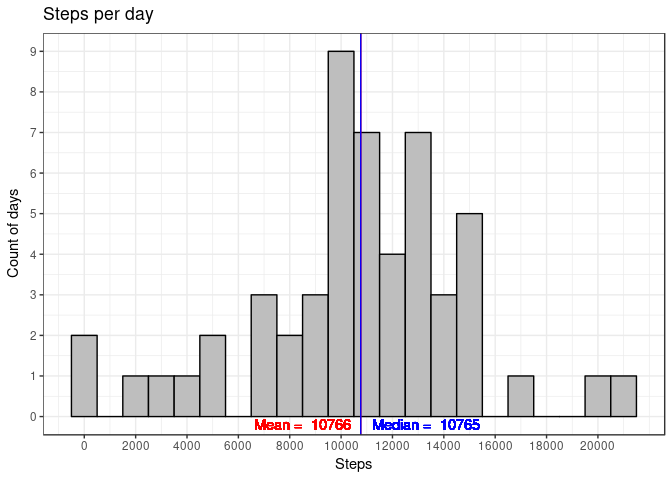
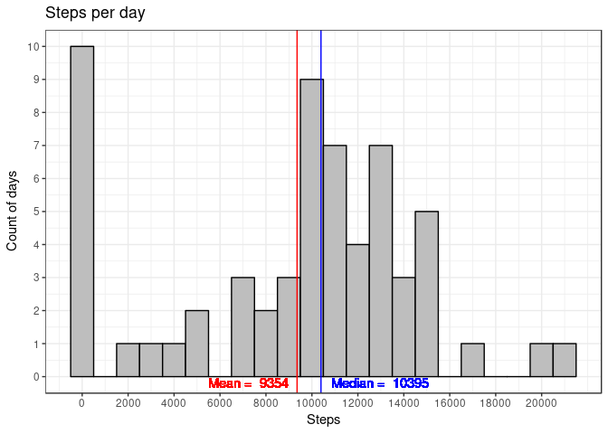
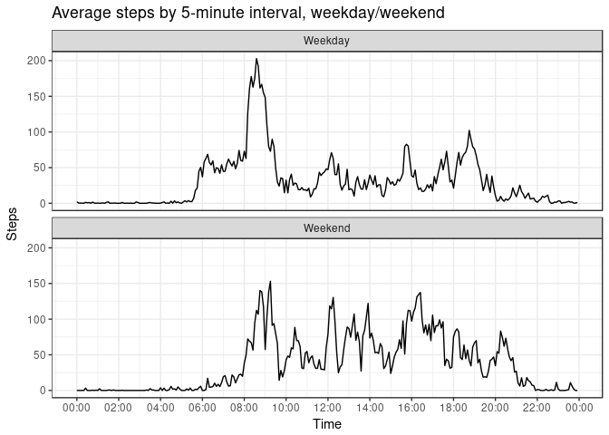

## Loading and preprocessing the data
- Get the data from file "activity.csv"
- Set variable "date" to Date format

```r
dfSteps <- read.csv("./data/activity.csv")
dfSteps$date <- as.Date(as.character(dfSteps$date), "%Y-%m-%d")
```
## What is mean total number of steps taken per day?
- Calculate total steps each day (function "aggregate")
- Plot histogram with steps (use ggplot2 library)
- Add lines for Mean and Median

```r
dfStepsByDay <- aggregate(steps ~ date, dfSteps, sum)
library(ggplot2)
ggplot(data = dfStepsByDay, aes(steps))+
  geom_histogram(binwidth = 1000, colour = "black", fill = "grey")+
  geom_vline(xintercept = mean(dfStepsByDay$steps),
             colour = "red",
             show.legend = TRUE)+
  geom_text(x = mean(dfStepsByDay$steps),
            y = -0.2,
            label = paste("Mean = ",
                          as.character(round(mean(dfStepsByDay$steps)))),
            colour = "red",
            hjust = 1.1)+
  geom_vline(xintercept = median(dfStepsByDay$steps),
             colour = "blue",
             show.legend = TRUE)+
  geom_text(x = median(dfStepsByDay$steps),
            y = -0.2,
            label = paste("Median = ",
                          as.character(round(median(dfStepsByDay$steps)))),
            colour = "blue",
            hjust = -0.1)+
  scale_y_continuous(breaks = c(0:11))+
  scale_x_continuous(breaks = c(0:10)*2000)+
  labs(x = "Steps", y = "Count of days", title = "Steps per day")+
  theme_bw()
```

<!-- -->

We are ignore NA values now.
Value of Mean and Median are the same, equal to 10765.

## What is the average daily activity pattern?
- Calculate average steps for each intervals (function "aggregate")
- Set new variable "int_time" for interval in Date-Time format
- Calculate interval with max average steps
- Plot line for average steps and point for max interval

```r
dfStepsByInterval <- aggregate(steps ~ interval, dfSteps, mean)
library(stringr)
library(lubridate)
```

```
## 
## Attaching package: 'lubridate'
```

```
## The following object is masked from 'package:base':
## 
##     date
```

```r
dfStepsByInterval$int_time <- strptime(
                                paste(
                                  str_pad(as.character(dfStepsByInterval$interval %/% 100)
                                          ,2
                                          ,pad = "0"),
                                  str_pad(as.character(dfStepsByInterval$interval %% 100),
                                          2,
                                          pad = "0"),
                                  sep = ":"),
                                format = "%H:%M")

numMaxSteps <- max(dfStepsByInterval$steps)
timeMaxInt <- dfStepsByInterval$int_time[dfStepsByInterval$steps == numMaxSteps]

ggplot(data = dfStepsByInterval, aes(int_time, steps))+
  geom_line()+
  geom_point(aes(x = timeMaxInt, y = numMaxSteps), colour = "red")+
  geom_text(aes(x = timeMaxInt, y = numMaxSteps),
            label = paste("Max steps",
                          as.character(round(numMaxSteps)),
                          ", interval",
                          as.character(hour(timeMaxInt)),
                          ":",
                          as.character(minute(timeMaxInt))),
            colour = "red",
            hjust = -0.1)+
  scale_x_datetime(date_label = "%H:%M", date_breaks = "2 hours")+
  labs(x = "Time", y = "Steps", title = "Average steps by 5-minute interval")+
  theme_bw()
```

<!-- -->

We can see some spikes in average activity pattern:

- Morning activity from 08:00 to 09:00 (average max steps per day is in 08:35 interval)
- Day activity about 12:00, 16:00 and 19:00

## Imputing missing values
- Decide to set NA values to 0
- Recalculate steps per day with 0 instead of NA
- Plot new histogram and Mean and Median lines

```r
  sum(is.na(dfSteps))
```

```
## [1] 2304
```

```r
  sum(is.na(dfSteps$steps))
```

```
## [1] 2304
```

```r
  dfSteps$steps[is.na(dfSteps$steps)] <- 0
  sum(is.na(dfSteps$steps))
```

```
## [1] 0
```

```r
  dfStepsByDay <- aggregate(steps ~ date, dfSteps, sum)

ggplot(data = dfStepsByDay, aes(steps))+
  geom_histogram(binwidth = 1000, colour = "black", fill = "grey")+
  geom_vline(xintercept = mean(dfStepsByDay$steps),
             colour = "red",
             show.legend = TRUE)+
  geom_text(x = mean(dfStepsByDay$steps),
            y = -0.2,
            label = paste("Mean = ",
                          as.character(round(mean(dfStepsByDay$steps)))),
            colour = "red",
            hjust = 1.1)+
  geom_vline(xintercept = median(dfStepsByDay$steps),
             colour = "blue",
             show.legend = TRUE)+
  geom_text(x = median(dfStepsByDay$steps),
            y = -0.2,
            label = paste("Median = ",
                          as.character(round(median(dfStepsByDay$steps)))),
            colour = "blue",
            hjust = -0.1)+
  scale_y_continuous(breaks = c(0:11))+
  scale_x_continuous(breaks = c(0:10)*2000)+
  labs(x = "Steps", y = "Count of days", title = "Steps per day")+
  theme_bw()
```

<!-- -->

Now we see, that value of Mean move to the left, after we add some "zero steps" days (before preparation they were "NA steps" days, and not affect)

## Are there differences in activity patterns between weekdays and weekends?
- Add new variable to dataset with factor Weekday/Weekend for each day
- Calculate average steps by intervals in weekdays and weekends
- Set new variable "int_time" for interval in Date-Time format
- Plot two lines for average steps in Weekdats/Weekend

```r
library(chron)
```

```
## 
## Attaching package: 'chron'
```

```
## The following objects are masked from 'package:lubridate':
## 
##     days, hours, minutes, seconds, years
```

```r
dfSteps$weekend <- factor(is.weekend(dfSteps$date),
                          levels = c(FALSE, TRUE),
                          labels = c("Weekday", "Weekend"))

dfStepsByIntWD <- aggregate(steps ~ interval + weekend, dfSteps, mean)

dfStepsByIntWD$int_time <- strptime(
  paste(
    str_pad(as.character(dfStepsByIntWD$interval %/% 100)
            ,2
            ,pad = "0"),
    str_pad(as.character(dfStepsByIntWD$interval %% 100),
            2,
            pad = "0"),
    sep = ":"),
  format = "%H:%M")

ggplot(data = dfStepsByIntWD, aes(int_time, steps))+
  geom_line()+
  facet_wrap(~weekend, ncol = 1, nrow = 2)+
  scale_x_datetime(date_label = "%H:%M", date_breaks = "2 hours")+
  labs(x = "Time", y = "Steps", title = "Average steps by 5-minute interval, weekday/weekend")+
  theme_bw()
```

<!-- -->

We can see, that maximum day activity higher in Weekdays (and morning activity begin earlier), but average day activity is higher in Weekends
